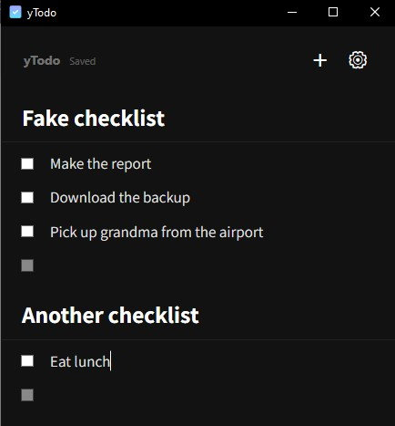
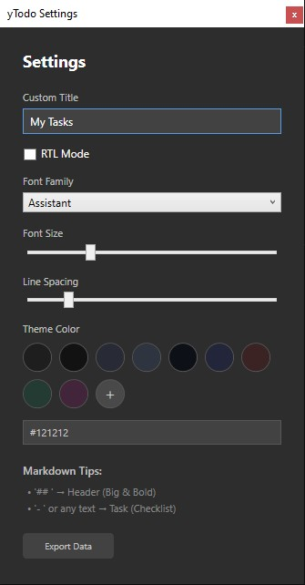

# yTodo

A lightweight, keyboard-centric TODO and note-taking application for Windows, built with .NET 8 and WPF. `yTodo` is designed to stay out of your way while providing a seamless experience for managing tasks, headers, and notes.




## Features

### 🚀 Seamless Interaction
- **Keyboard-First Design**: 
    - Press `Enter` to create a new entry.
    - Use `Backspace` on an empty entry to remove it or change its type.
    - Navigate through entries using the `Up` and `Down` arrow keys.
- **Smart Pasting**: Paste multiple lines of text to automatically create separate entries.
- **System Tray Integration**: Minimize to tray to keep your workspace clean.

### 📝 Smart Entry Types
`yTodo` automatically formats your entries based on simple prefixes:
- **Headers**: Start a line with `## ` to create a bold header.
- **Tasks**: Start a line with `- ` to create a task with a checkbox.
- **Notes**: Any other text is treated as a regular note.

### 🔗 Link Detection
- **Auto-Link**: Automatically detects URLs in your entries.
- **Title Fetching**: Fetches the webpage title and displays it as a clickable link below your entry.

### 🎨 Highly Customizable
Access the settings menu to personalize your experience:
- **Themes**: Set a custom background color using Hex codes.
- **Typography**: Choose from a variety of fonts (including RTL-optimized ones like Assistant and Heebo) and adjust font size and line spacing.
- **RTL Support**: Full support for Right-to-Left languages like Hebrew and Arabic.



### 💾 Data & Export
- **Auto-Save**: Your data is automatically saved as you type.
- **Export**: Save your lists as formatted `.txt` files or as `.json` for backup and portability.
- **Persistence**: Remembers your window position, size, and state across sessions.

## Technology Stack
- **Framework**: .NET 8.0 (WPF)
- **Language**: C#
- **Storage**: Local JSON storage
- **UI**: XAML with MVVM Architecture

## Getting Started

### Prerequisites
- Windows 10/11
- [.NET 8.0 Runtime](https://dotnet.microsoft.com/download/dotnet/8.0)

### Installation
1. Download the latest release.
2. Run `yTodo.exe`.

## Development

### Building from source
```powershell
dotnet build -c Release
```

### Project Structure
- **Models**: Data structures for Todo entries and app settings.
- **ViewModels**: Logic for the main window and individual entries.
- **Services**: Storage handling and URL title fetching.
- **Helpers**: Value converters for XAML.

## License
This project is licensed under the MIT License.
